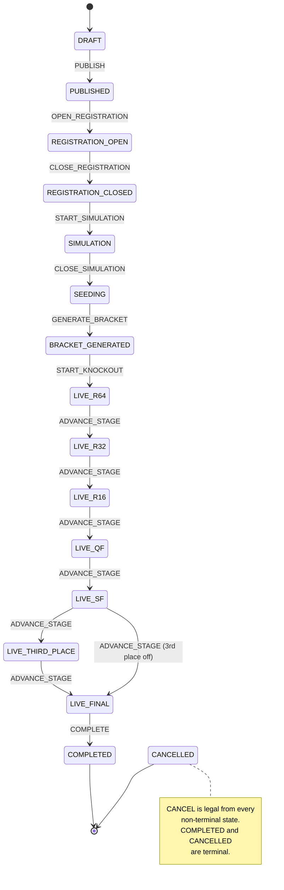

# 17 — Tournament Lifecycle, Seeding & Bracket Engine

> Implementation reference for **Epic E3**. Complements
> [`04-module-breakdown.md`](./04-module-breakdown.md) (module 4 and module 8) with the concrete
> state machine, the bracket topology, and the advancement rules as built.
> Decisions referenced: **D5** (win rule), **D6** (bracket sizes), **D7** (timings),
> **D13** (seeding), **D14** (sudden death), **D20** (stage profiles).

---

## 1. The lifecycle



Text form (`START_KNOCKOUT` enters whichever stage this bracket actually starts at — `QF` for an
8-team draw, `R64` for a 64-team draw):

```
DRAFT → PUBLISHED → REGISTRATION_OPEN → REGISTRATION_CLOSED → SIMULATION
      → SEEDING → BRACKET_GENERATED
      → R64 → R32 → R16 → QF → SF → [THIRD_PLACE] → FINAL → COMPLETED
```

### The state is a pair

`TournamentStatus` alone cannot say "we are in the quarter-finals" — every knockout round shares
`LIVE`. The lifecycle state is therefore the **pair** (`Tournament.status`,
`Tournament.currentStage`), flattened in code to a single key such as `LIVE:QF`.

Both halves are persisted columns. There is **no in-memory tournament state anywhere**: kill the
process at any point and the next call reads the committed pair and carries on. This is proved by
`verify:tournament:e2e`, which finishes a bracket in a genuinely separate `node` process that
knows nothing but the tournament id.

### Two kinds of rule

| | Enforced by | Skippable with `force`? |
|---|---|---|
| **The state machine** — is this edge real at all? | `lifecycle.ts` (pure) | **No, never.** |
| **Business guards** — is it sensible right now? (minimum registrations, evaluations drained, round finished) | `state.ts::assertGuards` | Yes — the `forceTournamentTransition` ops escape hatch. |

An illegal transition fails for everyone, including an admin with `force: true`. That is what
makes the persisted state trustworthy.

### Idempotency

Every transition writes an `OpsEvent` keyed deterministically:

```
optransition:{tournamentId}:{transition}                 // once per tournament
optransition:{tournamentId}:ADVANCE_STAGE:{fromState}    // once per stage
```

The key must stay **stable across the transition itself**, because a replay reads it *after* the
state has moved. A cron replay, a double-clicked admin button, or a retried job all find the
`DONE` event and return `applied: false` instead of running twice. A `SELECT … FOR UPDATE` on the
tournament row serialises genuinely concurrent callers.

---

## 2. Seeding (D13)

```
simulation round 1 ─┐
simulation round 2 ─┼─► sum of overallScore per competitor ─► rank (D5 chain) ─► all qualify
simulation round 3 ─┘                                                            seed = 1..N
```

- **All three rounds count**, summed — not best-of. A competitor with `[90,90,90]` outranks one
  with `[100,0,0]`.
- Ranking determines **seeding**, and seeding determines who receives a **bye**. It no longer
  determines who qualifies: under the amended D6 everyone eligible enters the draw.
- Ties fall through the **D5 tie-break order** applied to the aggregate totals; "faster
  submission" means the earlier *last* submission, i.e. who finished the whole simulation phase
  first. This still matters at the top of the order, where a better seed wins a bye.
- Registrants who never submitted still appear, scored 0, so the standings show the whole field.
- **N** is the bracket size: explicit if the organizer set one, otherwise the **smallest**
  supported size that fits the field (20 competitors play a 32 with 12 byes, not an 8 that would
  have cut 12 of them). A cutline survives only above 64.

Registrants who tie on **every** aggregate field (the common case: nobody submitted) are ordered
by **registration time**, then id. `rankByWinRule` is stable, so without an explicit order the
database would be free to return them differently on each run and the whole bracket would shift.

### Driving the phase

`CLOSE_REGISTRATION` **creates** the three simulation rounds, PENDING. `START_SIMULATION` opens
round 1 only. The split matters: `openRound` refuses a round with no problem attached, and
`assignProblemToRound` refuses a round that is no longer PENDING, so there has to be an interval
in which the rounds exist and are still closed. Creating and opening in one transaction left none,
and a tournament could only ever start with round 1 problem-less — a live countdown against a
statement that did not exist. This mirrors `GENERATE_BRACKET` creating the knockout rounds that
`START_KNOCKOUT` later opens. Both calls are idempotent upserts on
`(tournamentId, stage, sequence)`.

**Operationally: assign problems between closing registration and starting the simulation.**
Starting without them fails loudly with a `CONFLICT` naming the round.

`progressSimulation()` seals a round whose window has expired and opens the next, so all three
become playable; `progressTournament` routes a tournament in `SIMULATION` to it, meaning one
driver covers both phases and callers never need to know which phase they are in.

Nothing used to *call* that driver on a schedule. The runner's deadline sweep now does: it finds
rounds past `deadlineAt` and enqueues `advanceBracket`, which runs the pass. See D30.

Seeding then runs as the side effect of `CLOSE_SIMULATION`, guarded on **both**:

1. every simulation round being finished (`COMPLETED`/`JUDGING`/past its deadline), and
2. every simulation submission having reached a terminal state.

Either guard alone is insufficient. Checking only outstanding evaluations passes trivially seconds
after the phase starts — nobody has submitted yet — and would seed the tournament off an empty
field, which is the single most damaging thing this module could do.

`seedTournament` exists as a job for the ops case (a late evaluation, an admin score override) and
refuses to run once a bracket exists.

---

## 3. Bracket generation

**Input: the final seeding list, and nothing else.** Bracket generation performs no evaluation,
reads no scores, and recomputes no ranking. It is pure topology plus a seed → competitor mapping.

### Deterministic pairing

`seedOrder(n)` is built by repeated reflection — `[1] → [1,2] → [1,4,2,3] → [1,8,4,5,2,7,3,6]` —
so seed 1 and seed 2 can only meet in the final and every round pairs the best surviving seed
against the worst. `verify:bracket` asserts the classic property at every size: play the whole
draw letting the better seed always win, and seed 1 must be champion with seed 2 as runner-up.

### The whole tree is built at once

Every match of every round is materialised in one transaction, with empty competitor slots
upstream and `nextMatchId` / `nextMatchSlot` links already wired. Advancement then **fills** slots
rather than **creating** matches.

This is the main structural deviation from a literal reading of "automatic creation of the next
round", and it is deliberate:

- The invariants the brief asks for — no duplicate matches, no duplicate participants, no orphan
  rounds — become checkable at generation time (`assertBracketPlanValid`) instead of hoped-for at
  round boundaries.
- `nextMatchId` topology is meaningless unless the target exists.
- A crash mid-bracket has nothing to reconstruct.

"Automatic creation of the next round" is preserved behaviourally: when a round completes,
`ADVANCE_STAGE` opens the next round with a fresh server-authoritative window, automatically.

### Byes

A seed beyond the qualified field leaves an empty slot; its opponent gets a `BYE`. Byes are
resolved **immediately at generation** and cascade to a fixed point, so a spectator looking at a
freshly generated bracket already sees who walked into the next round.

Byes are **normal**, not exceptional. D6 sizes the draw to the smallest bracket that fits the
field, so any field that is not an exact power of two produces them:

| Field | Bracket | Byes | Awarded to |
|---|---|---|---|
| 8, 16, 32, 64 (exact) | same | 0 | — |
| 9 | 16 | 7 | seeds 1–7 |
| 11 | 16 | 5 | seeds 1–5 |
| 20 | 32 | 12 | seeds 1–12 |
| 9 in a 64 (organizer oversized) | 64 | 55 | cascades through empty matches |

Byes land on the top seeds without anything allocating them: `seedOrder` pairs seed *s* with seed
*n+1−s*, so the unfilled tail seeds are always the worst and their absent opponents always the
best. Deterministic, and reproducible from the field size alone.

**`VOID` matches cannot arise from automatic sizing.** The chosen bracket is the smallest that
fits, so more than half its seeds are always occupied, and every first-round pair contains a seed
from the top half. A void slot is only reachable when an operator explicitly oversizes a draw —
still supported, and still handled.

A bye needs no submission, no evaluation, no AI pass, no REST testing and no window. Downstream
systems do not test for it in order to be *correct*: the match is already `DECIDED` before any
round opens. What they do test for — in exactly one place, `bye.ts` — is whether a match should be
*counted* as something a human watches, and whether an empty slot is "waiting" or "empty forever".

---

## 4. Advancement (D5)

```
                  ┌─ 0 competitors ──────────────► VOID    (deep bye cascade)
match decision ───┼─ 1 competitor ───────────────► BYE
                  └─ 2 competitors
                       ├─ any evaluation pending ─► PENDING (never decide early)
                       ├─ window still open and
                       │  not both scored ────────► PENDING
                       ├─ exactly one scored ─────► WALKOVER
                       ├─ neither scored ─────────► WALKOVER to the better seed
                       │                            (configurable; else TIE)
                       └─ both scored ────────────► D5 chain
```

The **D5 chain**, in order, each recorded as the match's `winReason`:

| # | Rule | `WinReason` |
|---|---|---|
| — | highest overall score | `SCORE` |
| 1 | higher Functional score | `TIEBREAK_FUNCTIONAL` |
| 2 | more hidden tests passed | `TIEBREAK_TESTS` |
| 3 | faster submission | `TIEBREAK_TIME` |
| 4 | better Performance | `TIEBREAK_PERFORMANCE` |
| 5 | higher AI score | `TIEBREAK_AI` |
| 6 | sudden-death challenge | *(not built — see §7)* |

### The submission window gates every absence-based rule

A missing submission only *means* something once nobody can submit any more. While the window is
open, an absent submission is "not yet", not a forfeit. Without this, a freshly opened round is
indistinguishable from a round nobody entered, and the entire bracket walks over on seed order the
instant it starts. (This was a real bug, caught by `verify:tournament:e2e`; `verify:bracket`
carries the regression cases.)

**Nothing is decided on scores until the window closes** — not even a match where both entries
have already been scored. ~~A fully scored match is decided mid-window.~~ *(Corrected in E6.)*
E4 lets a competitor **replace** their entry until the deadline and a decided match is never
re-decided, so deciding early silently voided the right to improve. Byes and voids stay
structural and are settled whenever they are seen.

`progressTournament` seals an expired window itself (`OPEN` → `JUDGING` once `deadlineAt` passes),
so the deadline is enforced by the same pull that advances the bracket. There is no separate timer
to miss.

### Windows are scheduled per round, applied per match (E7)

Screen [10] and the roadmap both speak of "per-match submission windows". They are **derived**,
not stored: `getMatchWindow(matchId)` reads the match's round.

The schedule stays round-level deliberately. Every match at a stage must open at the same instant,
or the simultaneous-reveal guarantee is gone and whoever happened to be paired into a later slot
gets more thinking time on the same problem. One schedule means one source of truth, no drift
between two records of the same deadline, and the fairness property holds by construction rather
than by convention — the same principle D26 makes explicit for future environment profiles.

The timers themselves are **server-authoritative** in the strict sense: the server owns two
absolute instants (`opensAt`, `deadlineAt`) and publishes them with its own clock reading. The
browser measures its offset from that anchor once and renders `deadline − (localNow − offset)`, so
a wrong, tampered, sleeping or resuming client clock changes nothing. The countdown is decoration;
the Submission module refuses a late entry regardless of what any client displays. The pure
arithmetic lives in `tournament/timers.public.ts` and is shared by both sides so they cannot
disagree.

### Concurrency

Two guarantees make overlapping advancement passes safe:

- `progressTournament` takes the **same tournament row lock** `applyTransition` uses and re-reads
  the state inside it. A concurrent `CANCEL` therefore cannot commit between the read and the
  match writes, so decisions can never land in a cancelled tournament.
- Each match decision is **claimed** with a conditional `UPDATE … WHERE status <> 'DECIDED'`.
  `decideMatch` is deterministic so two passes would agree anyway, but propagation into the next
  round must happen exactly once, and this makes that structural rather than coincidental.

`ADVANCE_STAGE` is the one transition that repeats, so both its `OpsEvent` key and its **job**
key are stage-scoped. A shared job key would be an upsert no-op in `PgQueue.enqueue` and every
advance after the first would silently vanish — `enqueueTournamentTransition` throws if the stage
is omitted rather than allowing that.

### Third place

The semi-finals carry a second link, `loserNextMatchId`, into the third-place match. It is the
only place in the bracket where a loss routes somewhere instead of eliminating. Per the E3 brief
the play-off is scheduled **between SF and FINAL**, and a loss there is not an elimination — both
players already went out at the semi-final, and recording them as "eliminated at THIRD_PLACE"
would erase where they actually went out.

### Placements

1st/2nd from the final, 3rd/4th from the play-off. Everyone else is placed by the stage they went
out in, sharing a band — the standard single-elimination convention, and the only honest option
since the bracket never established an order within a round. A stage's band starts one past its
match count (QF has 4 matches → 4 survivors → QF losers band at 5).

---

## 5. Configuration

Nothing about a tournament's shape is hardcoded. Three layers, most specific winning:

| Layer | Where |
|---|---|
| 1. per-tournament | `Tournament.bracketSize`, `.thirdPlaceEnabled`, `.minRegistrations`, `.maxRegistrations`, `.roundDurations` (JSON), `.evaluationProfiles` (JSON, D20) |
| 2. environment | `TOURNAMENT_BRACKET_SIZE`, `TOURNAMENT_THIRD_PLACE_ENABLED`, `TOURNAMENT_MIN_REGISTRATIONS`, `TOURNAMENT_MAX_REGISTRATIONS`, `TOURNAMENT_SIMULATION_ROUNDS`, `TOURNAMENT_ADVANCE_HIGHER_SEED_ON_NO_SHOW` |
| 3. built-in | D6 sizes, D7 timings, D13 three rounds |

A malformed override is **logged and ignored**, falling through to the next layer — the same rule
D20 applies to evaluation profiles. An organizer's typo must never brick a running tournament.

---

## 6. Module boundaries

```
Authentication ──► who you are            (never imported by the engine's decisions)
Tournament ──────► lifecycle · registration · windows · seeding · bracket · advancement
                   ...and the stage → EvaluationProfile policy (D20)
Evaluation ──────► evaluation only        (stage-agnostic; receives a resolved profile)
```

- The Tournament module imports the Evaluation Engine's `EvaluationProfile` **type** and reads
  `Evaluation` **rows**. It never calls the engine.
- The engine still contains no stage logic and no AI special cases (D20 architectural rule
  unchanged).
- Registration is a *state* here. Free registration creates an `ACTIVE` row with no expiry.
  Paid checkout first creates an `ACTIVE` unpaid seat hold with `holdExpiresAt`, in the same
  transaction that increments `Tournament.participantCount`, so capacity is reserved before
  Razorpay can charge the user. Expiry reconciliation revokes stale unpaid holds and decrements
  the reservation count. Successful capture conditionally attaches `Registration.paymentId`,
  clears `holdExpiresAt`, marks the `Payment` paid, and recomputes the prize pool without claiming
  a second seat.
- Submissions are created by E5. E3 owns only the **window** (`isSubmissionWindowOpen`,
  `getSubmissionWindow`) so E5 asks rather than re-deriving the schedule.

---

## 7. Deliberately not built in E3

| | Why | Where it lands |
|---|---|---|
| **Sudden death** (D5.6, D14) | A tie surviving all five tie-breaks sets `Match.tieUnresolved`, leaves the match `JUDGING`, and logs loudly. Resolving it needs a new short challenge + round, which is the bracket epic's job. | E6.3 ✅ |
| Admin UI (tournaments/problems/dashboard) | E3 delivers the engine and its server actions; screens are a separate deliverable. | E3.3–E3.5 |
| Bracket UI | — | E6.4 |
| Cron wiring | **Resolved: there is no cron.** Round progression is triggered by the runner's deadline sweep, which enqueues `advanceBracket`. Railway Cron cannot serve this — 5-minute floor, and a cron service must exit. Coarse transitions stay admin/ops-driven. See D30 in `DECISIONS.md`. | Done |
| Payments / prize pool | Registration deliberately carries no money yet. | E4 |
| Submission creation, arena, problem reveal | E3 owns the window, not the submission. | E5 |

---

## 8. Verification

| Suite | Covers |
|---|---|
| `verify:tournament` | Every lifecycle edge; the exhaustive legal/illegal matrix per state; cancellation; stage lists per bracket size; state encoding; configuration layering and degradation |
| `verify:bracket` | Seed order; structure at 8/16/32/64 with and without third place; better-seed-wins property; determinism; byes incl. an oversized draw; every D5 tie-break step; window gating; seeding aggregation |
| `verify:live-arena` (E7) | Timer arithmetic at every boundary incl. clock-skew correction; arena state derivation; the reveal gate before `opensAt`; per-match windows deriving identically from one round; opponent progress withheld while the window is open; a late submission refused by the server; JUDGING past the timer; the deadlock → decider → result path from the competitor's side; the live snapshot's contents, its exclusions and its version stability; the feature flag's resolution order |
| `verify:tournament:e2e` | CRUD; the whole lifecycle against the database; refusal of invalid transitions; idempotent replay; registration limits, withdrawal and a concurrent re-registration race; submission windows and simulation-round progression; seeding from real evaluations plus determinism on a fully tied field; bracket generation and byes; automatic advancement; tie-break, walkover and third place; completion and placements; cancellation and `force`; the transition job and its stage-scoped keys; **restart recovery in a separate process** |
